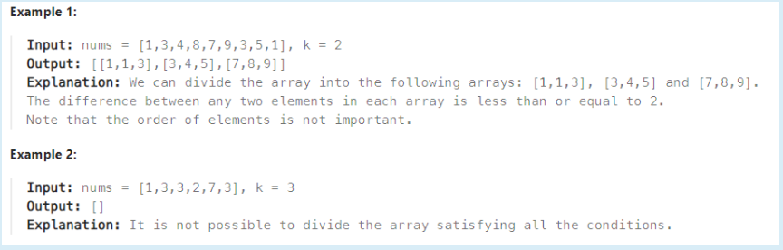

### 2966. Divide Array Into Arrays With Max Difference
2/1 Daily challenge
#### 題目

You are given an integer array nums of size n and a positive integer k.

Divide the array into one or more arrays of size 3 satisfying the following conditions:

- Each element of nums should be in exactly one array.
- The difference between any two elements in one array is less than or equal to k.
                             
Return a 2D array containing all the arrays. If it is impossible to satisfy the conditions, return an empty array. And if there are multiple answers, return any of them.




#### 解題思路

這題蠻簡單的，因為有**sort**，先將nums sort完後再繼續做

這題<font color="#3353FF">**重點是把input的 <vector> nums 每三個一組劃分成二維的vector**</font>
我的解法如下
- 將for迴圈i設成二維vector的row(sub vector)
- 後續將nums中的資料一一傳進去ans[i][check]
- check+=3 **(題目有說 級距為3)**
- 最後就是做簡單的check級距內是否有超過題目給定的k範圍

```C++
        vector<vector<int>> wrong;
        vector<vector<int>> ans(element,vector<int>(3));
        int check=0;//Point to the current position of nums(check+=3)
        for(int i=0;i<element;i++){            
            ans[i][0]=nums[check];           
            if((nums[check]+k<nums[check+1])||(nums[check]+k<nums[check+2])){
                return wrong;
            }
            else{
                ans[i][1]=nums[check+1];
                ans[i][2]=nums[check+2];
            }
            check+=3;
        }
```
