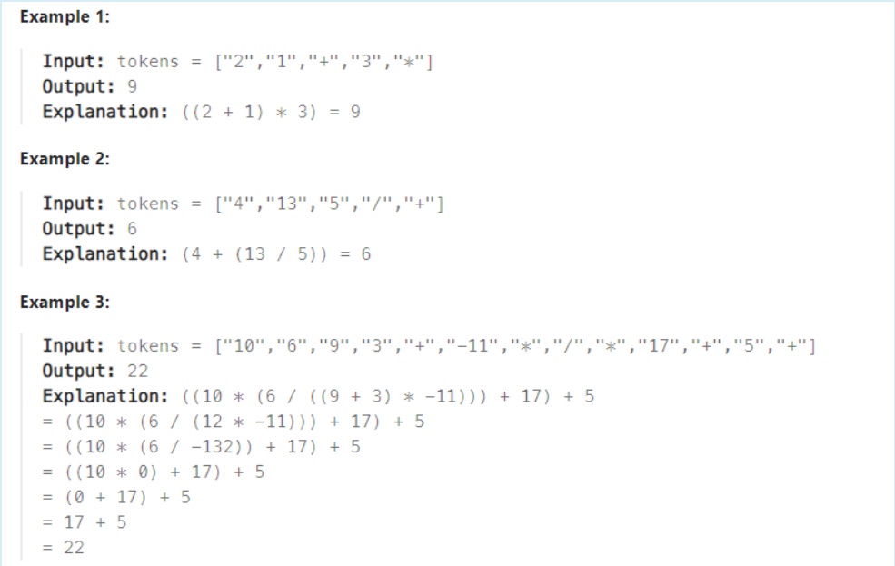

#### 題目

You are given an array of strings tokens that represents an arithmetic expression in a Reverse Polish Notation.

Evaluate the expression. Return an integer that represents the value of the expression.

Note that:

- The valid operators are '+', '-', '*', and '/'.
- Each operand may be an integer or another expression.
- The division between two integers always truncates toward zero.
- There will not be any division by zero.
- The input represents a valid arithmetic expression in a reverse polish notation.
- The answer and all the intermediate calculations can be represented in a 32-bit integer.

#### 解題思路

看到題目時，我就想到了**stack解法**(也確實是這個解法)

不過我在一開始使用了宣告ans當作中提計算結果儲存的變數**！！這個方法會有錯！！** 
錯在由於題目有
["3","11","5","+","-"]
["3","11","+","5","-"]
減號的位置不同會導致會有**16-3；3-16**的差異發生
    
**正確解法** : **直接將計算結果push回stack內**

