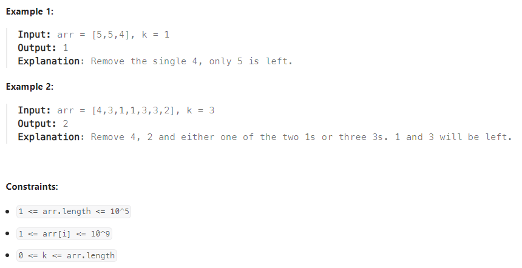
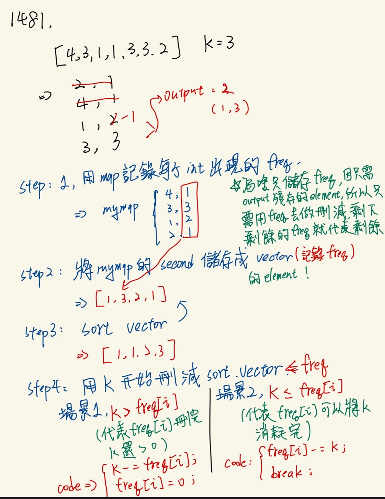

#### 題目
:::info
Given an array of integers arr and an integer k. Find the least number of unique integers after removing exactly k elements.
    

 

:::
#### 解題想法 
:::success

**想了蠻久的，但一開始的方向錯了，太執著於要保留原始int資料，因此有點卡關，但其實只要記錄int出現的頻率，再去做sort，之後用那個頻率去做刪減，就可以得到剩餘的element了**  
    

:::