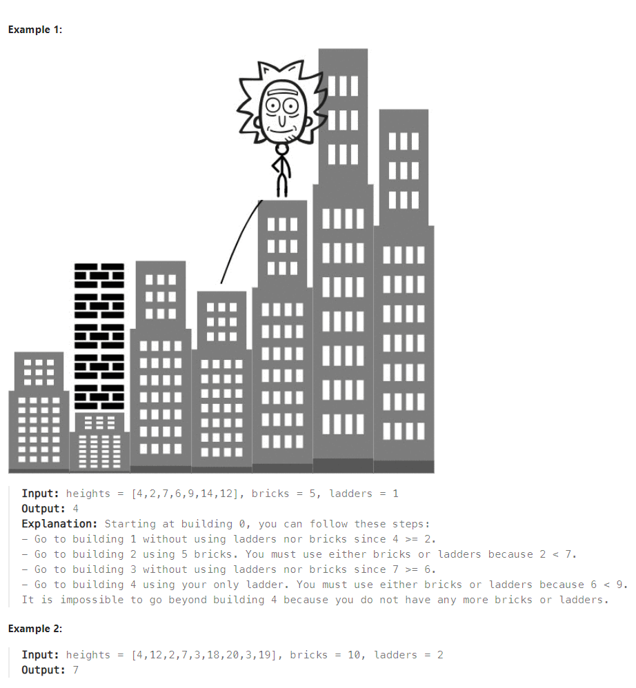
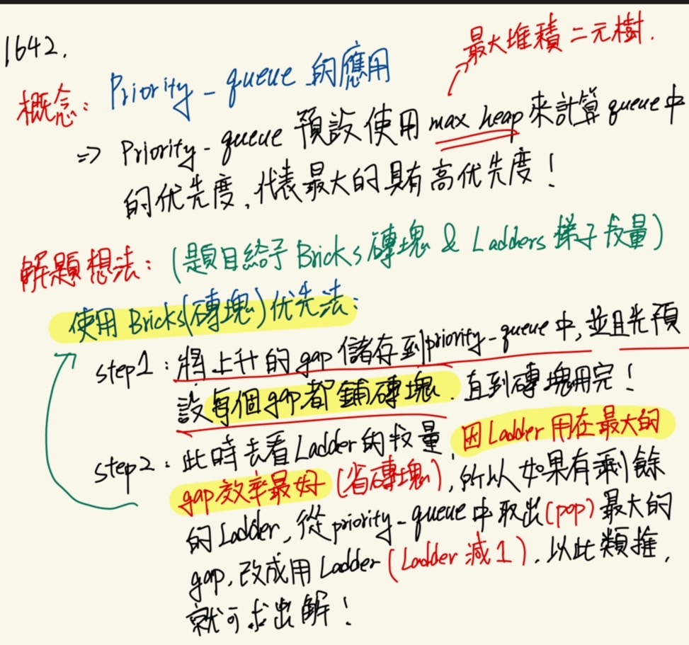
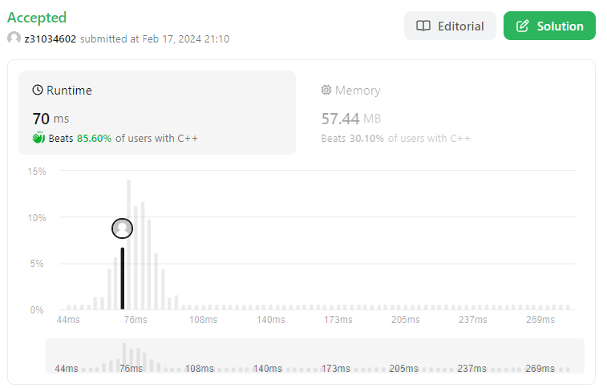

#### 題目
:::info
You are given an integer array heights representing the heights of buildings, some bricks, and some ladders.

You start your journey from building 0 and move to the next building by possibly using bricks or ladders.

While moving from building i to building i+1 (0-indexed),

- If the current building's height is greater than or equal to the next building's height, you do not need a ladder or bricks.
- If the current building's height is less than the next building's height, you can either use one ladder or (h[i+1] - h[i]) bricks.
    
Return the furthest building index (0-indexed) you can reach if you use the given ladders and bricks optimally.

 

:::
#### 解題想法 
:::success

**主要是用pqiority Queue(Max Heap的應用)，再加上Bricks優先法，就可以很好解決**  

:::