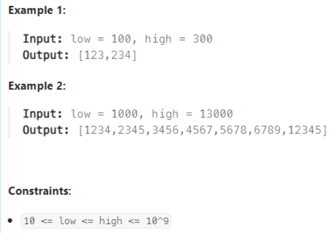

### 1291. Sequential Digits
2/2 Daily
####題目

An integer has sequential digits if and only if each digit in the number is one more than the previous digit.

Return a sorted list of all the integers in the range [low, high] inclusive that have sequential digits.
                       

#### 解題思路

這題一樣蠻簡單的，**暴力法可以解決**

題目最下面有說low,high限制為10~10^9
因此我們可以**先將所有可能性列出來成一個total vector**
及12,23,34,45,56,67,78,89,123,234,345,456,567,678,789,1234,2345,3456,4567,5678,6789,12345,23456,34567,45678,56789,123456,234567,345678,456789,1234567,2345678,3456789,12345678,23456789,123456789
    
最後再依照low,hight去將total vector中符合的加入到ans中
Time O(1)

